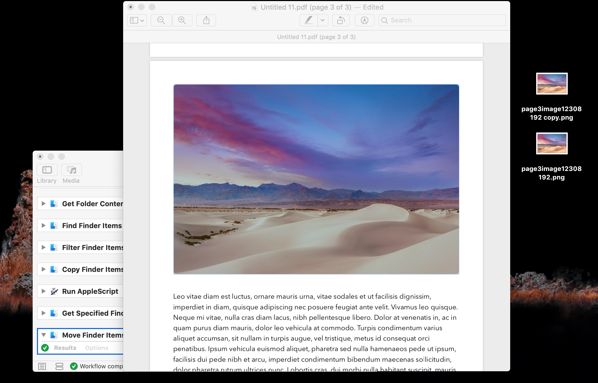

# PDF-IMG-Extractor
This automator script copies images from PDFs into the clipboard, creates a rich text file on the desktop, converts that file into a folder, copies disred images and lastly, removes the temporary files.
## Here are some screen shots; 

Automator-Workflow that extracts images from PDFs. 
